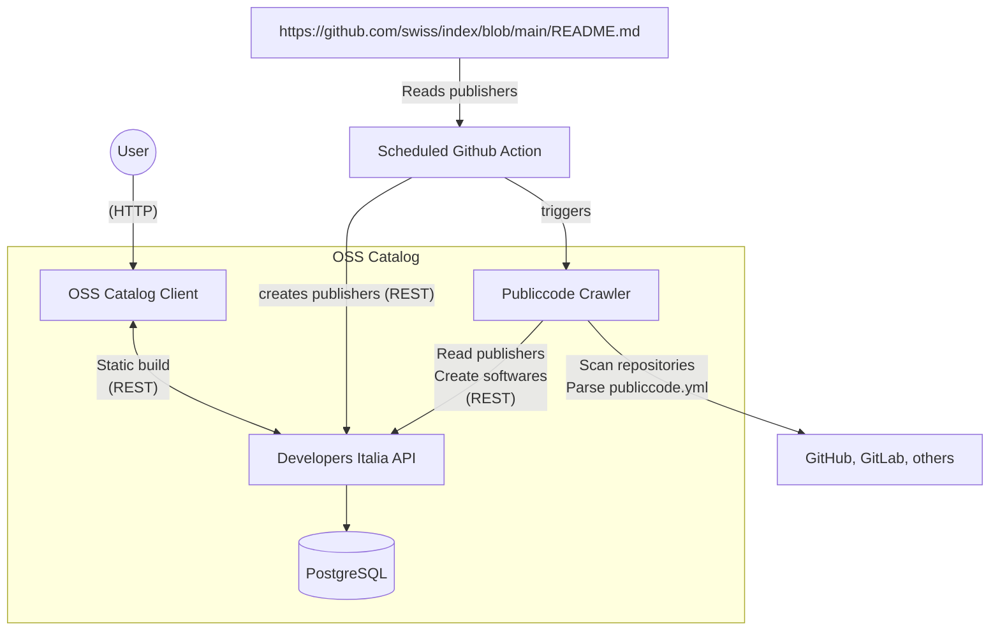

# Open Source Software Catalog

The Open Source Software Catalogue provides an overview of free and open-source software developed by or for the Swiss Confederation.
It is based on the [Public Code](https://github.com/publiccodeyml) standard, which describes software in a machine-readable way, making it discoverable and understandable for both developers and non-technical users.

## Context



## Usage

### Overview

What you will do:

- Clone this repo
- Generate PASETO key & create GitHub API token
- Start API service (and DB)
- Start catalog web application
- Add publisher(s) via catalog web application
- Run crawler
- Observe the collected softwares in the catalog web application
- Build and run the new astro based client

### Preparation

Clone this repository:

```bash
git clone git@github.com:puzzle/oss-catalog.git
cd oss-catalog/
git submodule init
git submodule update
```

To update the submodules:

```bash
git submodule update --remote --merge
```

Generate PASETO key:

```bash
./paseto/generate-paseto-key.sh
```

Create GitHub API Token with the `public_repo` Permission under https://github.com/settings/tokens and add it to the .env file:

```bash
echo "GITHUB_TOKEN=<your access token>" >> .env
```

### API Service

Start API with database:

```bash
./start-api
```

#### Use API via Curl (optional)

Generate PASETO token (valid for 24h):

```bash
source .env
cd paseto/go
PASETO_TOKEN="$(go run paseto-generate.go $PASETO_KEY)"
```

List publishers (no authentication needed):

```bash
curl http://localhost:3000/v1/publishers
```

Create a publisher:

```bash
curl -X POST -H "Authorization: Bearer $PASETO_TOKEN" -H "Content-Type: application/json" -d '{"codeHosting": [{"url": "https://github.com/swiss/", "group": true}], "description": "Swiss Government"}' http://localhost:3000/v1/publishers
```

curl -X POST -H "Authorization: Bearer $PASETO_TOKEN" -H "Content-Type: application/json" -d '{"codeHosting": [{"url": "https://github.com/sfa-siard/siard-suite", "group": false}], "description": "SIARD Suite"}' https://oss-catalog-api.ocp.cloudscale.puzzle.ch/v1/publishers

### Import Publishers

The readme at github.com/swiss/index/readme.md contains the list of relevant publishers that should be added to the catalog. The importer will read this list and create publishers in the catalog.

Run the script:

```bash
cd publisher-importer/
nvm use
PASETO_TOKEN=$PASETO_TOKEN API_ENDPOINT=http://localhost:3000 npm start
```

### Crawler

Run crawler - this will crawl all repositories in the API, checks for publiccode.yml and add them to the database if available and valid.

```bash
./start-crawler
```

### Catalog Client Application

Start the catalog client application:

```bash
./start-client
```

Or start outside of Docker in development mode:

```bash
cd client/
nvm use
npm install
npm run dev
```

Then visit http://localhost:4321

## Add new repositories to remote API in production

- Grab PASETO key from production, e.g. from your vault.
- Set PASETO_KEY environment variable
  `PASETO_KEY="<your paseto key>"`
- Generate the paseto token
  ```
  cd paseto/go
  PASETO_TOKEN="$(go run paseto-generate.go $PASETO_KEY)"
  ```
- Run the repository script (it's safe to push repos multiple times!)
  ```
  cd publisher-importer/
  nvm use
  PASETO_TOKEN=$PASETO_TOKEN API_ENDPOINT=<your api endpoint> npm start
  ```

### Known Issues

- The actual deletion of a publisher or software in the database takes a while (as if it is done asynchronously in the API).

## Resources

- [publiccode.yml Standard](https://github.com/publiccodeyml/publiccode.yml)
- [publiccode.yml crawler for the software catalog of Developers Italia](https://github.com/italia/publiccode-crawler)
  - Fetches registered publishers from the Developers Italia API, crawles all their repositories & feeds the publiccode.yml results into the Developers Italia API.
- [publiccode.yml parser for Go by Developers Italia](https://github.com/italia/publiccode-parser-go) – Used by the publiccode.yml crawler
- [Developers Italia API](https://github.com/italia/developers-italia-api) – Stores the results of the publiccode.yml crawler in a PostgreSQL db, runs at https://api.developers.italia.it/v1/software
- [publiccode yml Editor by Developers Italia](https://github.com/italia/publiccode-editor) – Web UI to conveniently edit publiccode.yml files
- [Developers Italia website](https://github.com/italia/developers.italia.it) – Italy's [OSS catalog](https://developers.italia.it/en/software) (Jekyll site)
  - Downloads crawled softwares from Developers Italia API: https://github.com/italia/developers.italia.it/blob/main/scripts/get-software.js
- [More publicode.yml components by Developers Italia](https://github.com/italia#-publiccode)
- List of the [organisations of the Swiss Confederation](https://github.com/swiss/publiccode-editor/tree/cd-bund/src/app/data/README.md)
