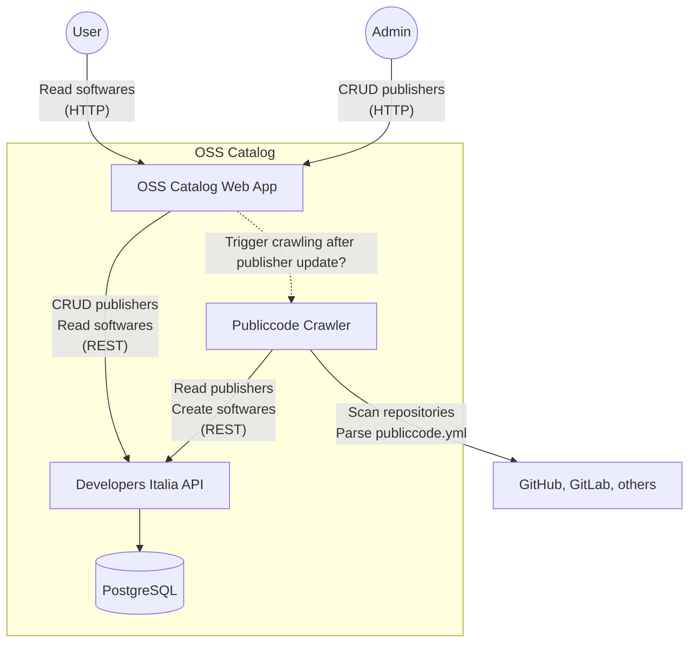

# Open Source Software Catalog POC

Proof-of-concept for an Open Source software catalog based on the [Publiccode](https://github.com/publiccodeyml) standard.

## Context



## Usage

### Overview

What you will do:

- Clone this repo
- Generate PASETO key & create GitHub API token
- Start API service (and DB)
- Start catalog web application
- Add publisher(s) via catalog web application
- Run crawler
- Observe the collected softwares in the catalog web application
- Run the new astro based client

### Preparation

Clone this repository:

```
git clone git@github.com:puzzle/oss-catalog.git
cd oss-catalog/
git submodule init
git submodule update
```

Generate PASETO key:

```
./paseto/generate-paseto-key.sh
```

Create GitHub API Token with the `public_repo` Permission under https://github.com/settings/tokens and add it to the .env file:

```
echo "GITHUB_TOKEN=<your access token>" >> .env
```

### API Service

Start API with database:

```
./start-api
```

#### Use API via Curl (optional)

Generate PASETO token (valid for 24h):

```
source .env
cd paseto/go
PASETO_TOKEN="$(go run paseto-generate.go $PASETO_KEY)"
```

List publishers (no authentication needed):

```
curl http://localhost:3000/v1/publishers
```

Create a publisher:

```
curl -X POST -H "Authorization: Bearer $PASETO_TOKEN" -H "Content-Type: application/json" -d '{"codeHosting": [{"url": "https://github.com/swiss/", "group": true}], "description": "Swiss Government"}' http://localhost:3000/v1/publishers
```

### Catalog Client Application

Start the catalog client application:

```
./start-client
```

Or start outside of Docker in development mode:

```
cd client/
nvm use
npm install
npm run dev
```

Then visit http://localhost:4321

### Crawler

Run crawler:

```
./start-crawler
```

## Work

Required tasks to bring the OSS catalog into production:

- [x] Proof-of-concept
- [ ] Deploy & operate API service & DB
  - 1 container for API service
  - Dedicated PostgreSQL service or 1 container
  - Or use SQLite?
  - SSL/Cert
- [x] Design & implement website
  - Static site, based on a Static Site Generator (SSG)
  - Fetches data from API service at build-time
  - [CD Bund](https://www.bk.admin.ch/bk/de/home/dokumentation/cd-bund/cd-manual.html)?
  - List of all projects (can we statically generate this or do we have to paginate & render it on client?) \
    → Example: https://developers.italia.it/en/search
  - Detail page of a project with links etc. \
    → Example: https://developers.italia.it/en/software/685ff6c9-c2e9-4e3b-a092-5d3208b4491c
- [ ] Deploy & operate website
  - Same operation environment as API/DB? GitHub Pages? ...
  - Domainname?
  - SSL/Cert
- [ ] Optional: Implement advanced website features
  - Search
  - Facetted search → Filter by type, category, status etc.
  - https://pagefind.app/ or with additional query service that accesses the same DB?
- [ ] Build mechanism to manage publishers
  - Based on a file in a repository, e.g. Markdown (https://github.com/swiss/index) or JSON
  - GitHub Actions workflow that:
    1. Reads/parses the file
    2. Updates/syncs publishers to API service
    3. Runs the crawler
    4. Triggers a rebuild of the website
- [ ] Perodically run crawler to catch updated publiccode.yml
  - GitHub Actions worflow with schedule
- [ ] Optional: Perodically run [publiccode.yml issues bot](https://www.bk.admin.ch/bk/de/home/dokumentation/cd-bund/cd-manual.html)

Required modifications/contributions to the OSS components:

- In the above solution there we can generate PASETO v2 tokens in the GitHub Actions workflows via a script/CLI tool, sharing the PASETO_KEY secret between the API service and the workflows. So we could live with the PASETO-based authentication mechanism of the components.
- Analyze why deletions aren't immediately reflected in the data. Does this also apply to updates? Can/should we fix this?

## Notes

### General

- Italy's solution uses PASETO v2 auth tokens. There must be a way to "login" and fetch a token, either as part of the web app, or via an auth provider that supports this.
- The web app displaying the softwares to the users could also be implemented with static site generator (as Italy does). In this case, the site has to be re-generated after every crawling.
- The publishers could either be statically managed (file) or in a (separate) web app. In the latter case, there must be a way to identify (or authorize) administrators that are curating these publishers.
- The crawler seems to be very strict and only accepts publiccode.yml files that are fully correct.
- The crawler has to be triggered after a change to the publishers and also at regular intervals (to catch repository updates).
- The crawler seems to be supporting GitHub, GitLab and BitBucket.
- The log of a software (`/software/{softwareId}/logs`) contains its crawling activity.
- The API supports webhooks (see https://developers.italia.it/en/api/developers-italia.html). This would probably make it possible to create a crawler service that registers a webhook which will be called whenever the publishers are updated. It could then start the crawling.
- To ensure quality, there is also [a bot](https://github.com/italia/publiccode-issueopener) that fetches the GitHub repositories from the developers-italia-api, then validates the publiccode.yml of these repos and creates GitHub issues if something is not right.
- Projects using GitHub Actions or GitLab CI could use https://github.com/italia/publiccode-parser-gitlab-ci resp. https://github.com/italia/publiccode-parser-action to validate the publiccode.yml in the repository.

### Known Issues

- The actual deletion of a publisher or software in the database takes a while (as if it is done asynchronously in the API).

## Resources

- [publiccode.yml Standard](https://github.com/publiccodeyml/publiccode.yml)
- [publiccode.yml crawler for the software catalog of Developers Italia](https://github.com/italia/publiccode-crawler)
  - Fetches registered publishers from the Developers Italia API, crawles all their repositories & feeds the publiccode.yml results into the Developers Italia API.
- [publiccode.yml parser for Go by Developers Italia](https://github.com/italia/publiccode-parser-go) – Used by the publiccode.yml crawler
- [Developers Italia API](https://github.com/italia/developers-italia-api) – Stores the results of the publiccode.yml crawler in a PostgreSQL db, runs at https://api.developers.italia.it/v1/software
- [publiccode yml Editor by Developers Italia](https://github.com/italia/publiccode-editor) – Web UI to conveniently edit publiccode.yml files
- [Developers Italia website](https://github.com/italia/developers.italia.it) – Italy's [OSS catalog](https://developers.italia.it/en/software) (Jekyll site)
  - Downloads crawled softwares from Developers Italia API: https://github.com/italia/developers.italia.it/blob/main/scripts/get-software.js
- [More publicode.yml components by Developers Italia](https://github.com/italia#-publiccode)
