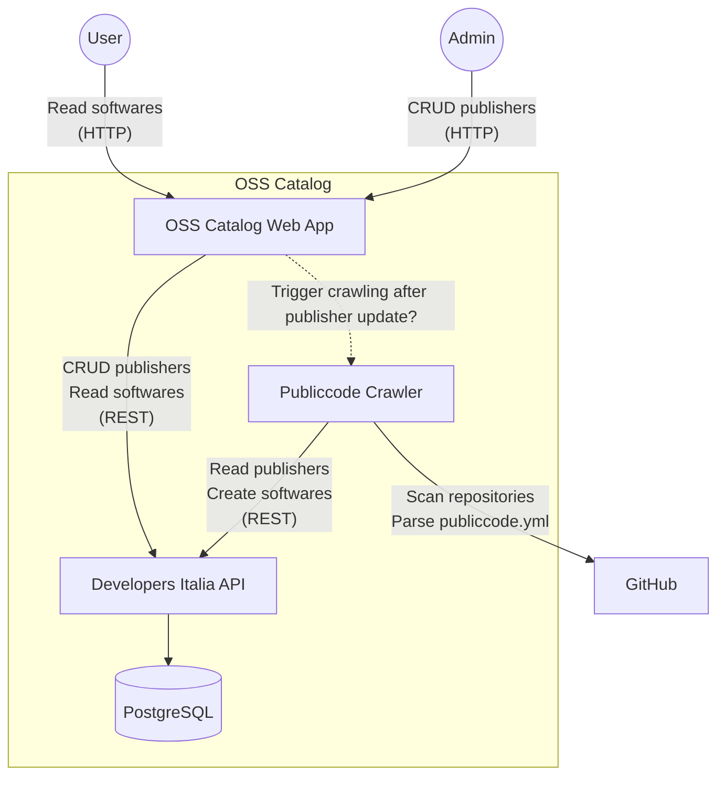

# OSS Catalog POC

Proof-of-concept for an Open Source catalog based on the [Publiccode](https://github.com/publiccodeyml) standard.

## Context



## Usage

Clone this repository:

```
git clone git@github.com:puzzle/oss-catalog.git
cd oss-catalog/
git submodule init
git submodule update
```

Generate PASETO key:

```
./paseto/generate-paseto-key.sh
```

Create GitHub API Token with the `public_repo` Permission under https://github.com/settings/tokens and add it to the .env file:

```
echo "GITHUB_TOKEN=<your access token>" >> .env
```

### API Service

Start API with database:

```
./start-api
```

#### Use API via Curl (optional)

Generate PASETO token (valid for 24h):

```
source .env
cd paseto/go
PASETO_TOKEN="$(go run paseto-generate.go $PASETO_KEY)"
```

List publishers (no authentication needed):

```
curl http://localhost:3000/v1/publishers
```

Create a publisher:

```
curl -X POST -H "Authorization: Bearer $PASETO_TOKEN" -H "Content-Type: application/json" -d '{"codeHosting": [{"url": "https://github.com/swiss/", "group": true}], "description": "Swiss Government"}' http://localhost:3000/v1/publishers
```

### Catalog Web Application

Start the catalog web application:

```
./start-web
```

Or start outside of Docker:

```
cd web/
npm install
npm run start-with-env
```

Then visit http://localhost:8080

### Crawler

Run crawler:

```
./start-crawler
```

## Notes

- Italy's solution uses PASETO v2 auth tokens. There must be a way to "login" and fetch a token, either as part of the web app, or via an auth provider that supports this.
- The web app displaying the softwares to the users could also be implemented with static site generator (as Italy does). In this case, the site has to be re-generated after every crawling.
- The publishers could either be statically managed (file) or in a (separate) web app. In the latter case, there must be a way to identify (or authorize) administrators that are curating these publishers.
- The crawler seems to be very strict and only accepts publiccode.yml files that are fully correct.
- The crawler has to be triggered after a change to the publishers and also at regular intervals (to catch repository updates).

### Known Issues

- The actual deletion of a publisher or software in the database takes a while (as if it is done asynchronously in the API).

## Resources

- [publiccode.yml Standard](https://github.com/publiccodeyml/publiccode.yml)
- [publiccode.yml crawler for the software catalog of Developers Italia](https://github.com/italia/publiccode-crawler)
  - Fetches registered publishers from the Developers Italia API, crawles all their repositories & feeds the publiccode.yml results into the Developers Italia API.
- [publiccode.yml parser for Go by Developers Italia](https://github.com/italia/publiccode-parser-go) – Used by the publiccode.yml crawler
- [Developers Italia API](https://github.com/italia/developers-italia-api) – Stores the results of the publiccode.yml crawler in a PostgreSQL db, runs at https://api.developers.italia.it/v1/software
- [publiccode yml Editor by Developers Italia](https://github.com/italia/publiccode-editor) – Web UI to conveniently edit publiccode.yml files
- [Developers Italia website](https://github.com/italia/developers.italia.it) – Italy's [OSS catalog](https://developers.italia.it/en/software) (Jekyll site)
  - Downloads crawled softwares from Developers Italia API: https://github.com/italia/developers.italia.it/blob/main/scripts/get-software.js
- [More publicode.yml components by Developers Italia](https://github.com/italia#-publiccode)
